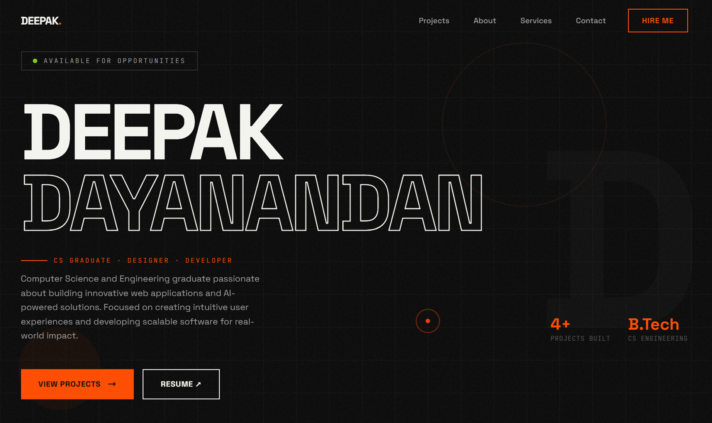

# ⚡ Deepak Dayanandan — Portfolio

A bold, brutalist-inspired developer portfolio built with **Next.js 14**, **Tailwind CSS**, and hand-crafted animations.

[**🔗 Live Demo**](https://deepakbuilds.vercel.app)

---

## ✨ Highlights

| Feature | Description |
|---|---|
| 🎨 **Brutalist Dark Theme** | Deep blacks with a fiery `#ff4d00` orange accent, neon yellow & cyan pops |
| 🖱️ **Custom Cursor** | Dual-ring reactive cursor with hover scale & blend-mode effects |
| 📽️ **Film Grain Overlay** | Subtle SVG-based grain animation for a cinematic texture |
| 🔄 **Scroll Reveal** | Directional fade-in animations (up, left, right) with staggered children |
| 🏷️ **Marquee Banner** | Continuously scrolling keyword ticker for visual rhythm |
| 📱 **Fully Responsive** | Mobile-first layout with touch-friendly cursor fallback |
| ⚡ **Performance First** | Optimized fonts (Space Grotesk + JetBrains Mono), minimal dependencies |

---

## 📸 Sections

- **Hero** — Large-scale name typography, tagline, availability status, stats, and CTA buttons
- **Projects** — Numbered project cards with category labels, tech tags, and external links
- **About** — Bio, experience overview, and education background
- **Services** — Core competencies (UI/UX Design, Frontend Dev, Design Systems, Prototyping)
- **Tech Stack** — Visual skill grid covering the full technologies
- **Contact** — Direct email link and social connections (GitHub, LinkedIn, Instagram)

---

## 🛠️ Tech Stack

| Layer | Technologies |
|---|---|
| **Framework** | Next.js 14 (App Router) |
| **UI Library** | React 18 |
| **Styling** | Tailwind CSS 3 + CSS custom properties |
| **Fonts** | [Space Grotesk](https://fonts.google.com/specimen/Space+Grotesk) · [JetBrains Mono](https://fonts.google.com/specimen/JetBrains+Mono) |
| **Animations** | CSS keyframes (marquee, grain, float, glitch, slide-up, scale-in) |
| **Deployment** | Vercel |

---

## 📄 License

This project is open source and available for personal use and learning. Feel free to fork it and make it your own!

---

**Designed & Developed by [Deepak Dayanandan](https://deepakbuilds.vercel.app)**

